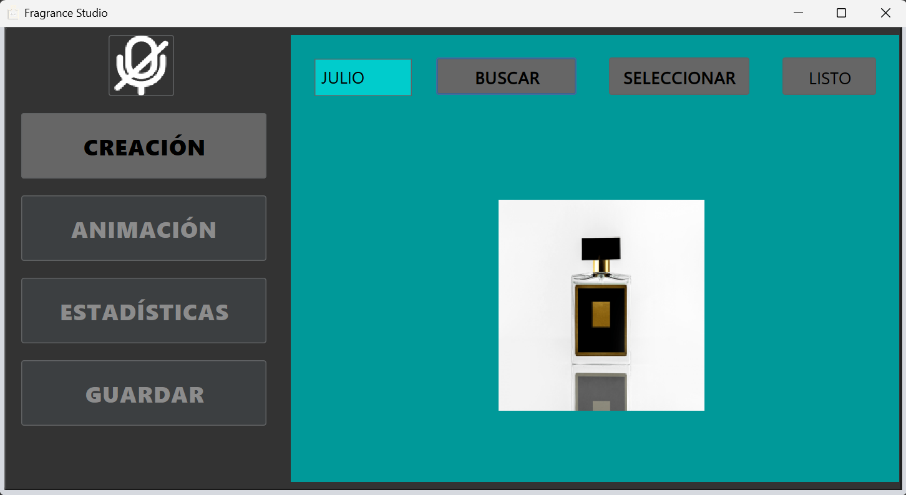

# App Fragance Studio

## App para generar gif, estadísticas y guardarlas en un folder

## Funcionamiento
- ### Fragance Studio es una app fácil de entender y usar. Solo debes de usar los botones laterales izquierdos, los cuales te llevarán a diferentes procesos.

### Creación

- #### Título: Ponle un título al folder que se creará.
- #### Buscar: Lanza el explorador de archivos para seleccionar una imagen de perfume disponible.

- #### Seleccionar: Lanza una vista de botones, donde cada botón es alguna imagen de perfume disponible.

### Animación

- #### Predeterminado: Elige alguna de las dos opciones y visualiza lo que sucede con la imagen del perfume.
- #### Frames: Elige alguna de las dos opciones y visualiza lo que sucede con la imagen del perfume.

### Estadísticas

- #### Circular: Visualiza estadisticamente tus preferencias anteriores en forma de torta/pastel.

- #### Barras: Elige los datos que deseas mostrar en el gráfico.

### Guardar

- #### Solo te queda observar tu escritorio y veras los resultados

## Tecnología
- ### Java